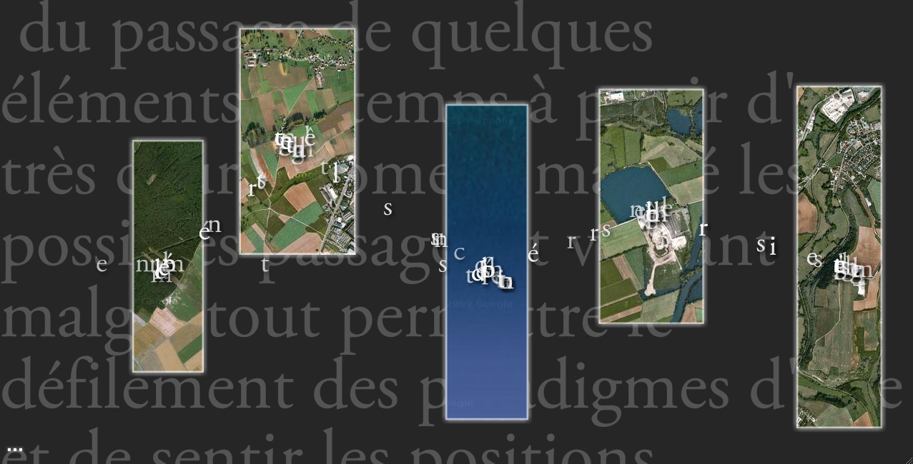
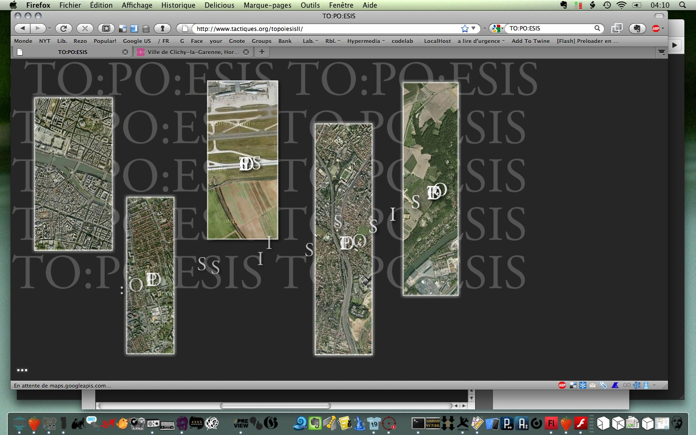

# To:po:iesis

## Description

The project is an interactive artwork developed in ActionScript 3 that leverages animations and transition effects to manipulate textual elements and geographical maps. It allows users to move letters and words in response to mouse movements, create masks for maps, and play background sounds. This interactive piece combines visual and auditory elements to create an engaging user experience. 

## Concept
The availability of mappable data and of base maps provide a rich breeding ground for artistic digital initiatives. Within this context, TO:PO:IESIS is an attempt to work on the double properties of the map, both graphical content management and creation of meaning. The map takes part into creating a poetic discourse, where words come into the non-discursive system of territorial representation, and in turn, where things are integrated into a textual apparatus.

La facilité d’accès à une multitude des données cartographiables et la mise à disposition de fonds de carte aisément manipulables fournissent un riche terreau pour les initiatives artistiques interrogeant notre rapport à l'espace. Au sein de ce contexte, TO:PO:IESIS cherche à mobiliser la double compétence de la carte, à la fois gestion graphique de contenu et création de sens. La carte participe de la création d’un discours poétique, où les mots passent dans le régime non-discursif de la représentation territoriale et où les choses sont intégrées dans un dispositif textuel.

## Credits
Jean-Christophe Plantin (design), Mehdi Bourgeois (design & development), Ryan King (sound)

## Screenshots and video

